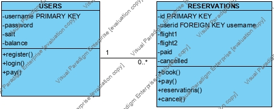

# Design Decisions

## Tables
I decided to add 2 tables to the database. The first one was the USERS table which consisted of a username (primary key), password (hashed), salt, and balance. I saved it in the database because I need to keep track of which users have been made between sessions which would not be possible without a database table. I made the username field the primary key so that there would only be unique usernames as specified in the spec.

The second table I made was the RESERVATION table. This consisted of an id (primary key), userid (foreign key to USERS(username)), flight1, flight2, paid, cancelled. I saved the RESERVATIONS as a table because I need to know all reservations different users made between sessions. I made the id field a primary key because all id's had to be unique. The userid foreign key is associated with the username field in the USERS table. flight1 and flight2 are the fids of flight1 and flight2 (flight2 is null if direct flight). I didn't make them foreign keys even though they act like foreign keys to the fid field in FLIGHTS table because the fid field is not a primary key, so without modifiying the FLIGHTS table I would not be able to specify flight1 and flight12 as foreign keys.

## In Memory
I stored a couple of things in memory. In order to know if a user was logged in I made a User Java class which was null when no one was logged in and stored a User's information when someone logged in. I stored the Itinerary locally by using an List<Flights> because I did not need to save the same itinerary between sessions. The Flights class made it easier to print out the itinerary and store information on flights I was working with. The final thing I saved in memory was Reservations. Whenever I added a new reservation to the database I found the size of the table and made each ID unique. I made a class so that whenever I got Reservations from the RESERVATIONS table I would be able to store and print them easily.

# UML Diagram
